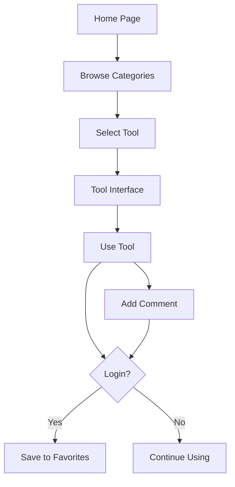

## 1. Product Overview

一个创意个性的多功能工具集合网站，汇集多种实用在线工具，为用户提供便捷高效的在线服务体验。
- 主要目的：提供各类实用工具，解决用户日常工作和生活中的小问题
- 目标用户：需要在线工具的普通用户、开发者、设计师等
- 市场价值：一站式工具平台，减少用户寻找工具的时间成本

## 2. Core Features

### 2.1 User Roles
| Role | Registration Method | Core Permissions |
|------|---------------------|------------------|
| Normal User | Email registration / OAuth | Use tools, save favorites, comment |
| Admin | System invite | Manage tools, moderate comments |

### 2.2 Feature Module
1. **Home Page**: Tool categories, featured tools, search functionality
2. **Tool Page**: Tool interface, usage history, sharing options
3. **Profile Page**: User info, saved tools, usage history
4. **Community Page**: Comments, ratings, tool suggestions

### 2.3 Page Details
| Page Name | Module Name | Feature description |
|-----------|-------------|---------------------|
| Home Page | Tool Categories | Categorized tool list with icons |
| Home Page | Featured Tools | Highlighted popular tools |
| Home Page | Search | Real-time search across tools |
| Tool Page | Tool Interface | Interactive tool with live preview |
| Tool Page | History | Recent usage records |
| Tool Page | Comments | User comments and ratings |
| Profile Page | User Info | Personal details and avatar |
| Profile Page | Favorites | Saved favorite tools |
| Profile Page | History | All usage history |
| Community Page | Comment List | All comments with filtering |
| Community Page | Suggestions | Submit new tool ideas |

## 3. Core Process

### User Flow: Browse and Use Tools
1. User visits home page → Browse tool categories → Select a tool → Use the tool → Share or comment

### User Flow: Register and Save
1. User clicks register → Fills form → Verifies email → Logs in → Uses tools → Saves favorites

### User Flow: Comment and Interact
1. User views tool → Clicks comments → Reads existing comments → Posts new comment → Views replies

## 4. User Interface Design

### 4.1 Design Style
- **Primary Color**: Gradient from vibrant purple (#8B5CF6) to electric blue (#3B82F6)
- **Secondary Color**: Neon green (#10B981) for accents and highlights
- **Background**: Dark mode with subtle gradients and animated particles
- **Button Style**: Rounded corners with glassmorphism effect, hover glow animations
- **Font**: Display font 'Orbitron' for titles, 'Inter' for body text
- **Layout**: Card-based with floating elements and depth effects
- **Icons**: Custom SVG icons with animated transitions

### 4.2 Page Design Overview
| Page Name | Module Name | UI Elements |
|-----------|-------------|-------------|
| Home Page | Hero Section | Animated gradient background, floating tool icons, search bar with glow |
| Home Page | Categories | Grid layout with category cards, hover scale effects, icon animations |
| Home Page | Featured Tools | Horizontal scroll with card flip effects on hover |
| Tool Page | Tool Interface | Dark theme with glowing input fields, real-time results panel |
| Tool Page | Comments | Expanding comment cards with avatar hover effects |
| Profile Page | Header | Animated background with user stats floating around |
| Community Page | Suggestions | Submit form with floating labels and validation animations |

### 4.3 Responsiveness
- Desktop-first design with mobile-adaptive layout
- Touch-optimized buttons and swipe gestures for mobile
- Collapsible navigation for small screens

### 4.4 Animations
- Page load: Staggered fade-in with scale effects
- Hover: Card lift, glow effects, icon rotations
- Transitions: Smooth page transitions with backdrop blur
- Background: Subtle particle animation in home page