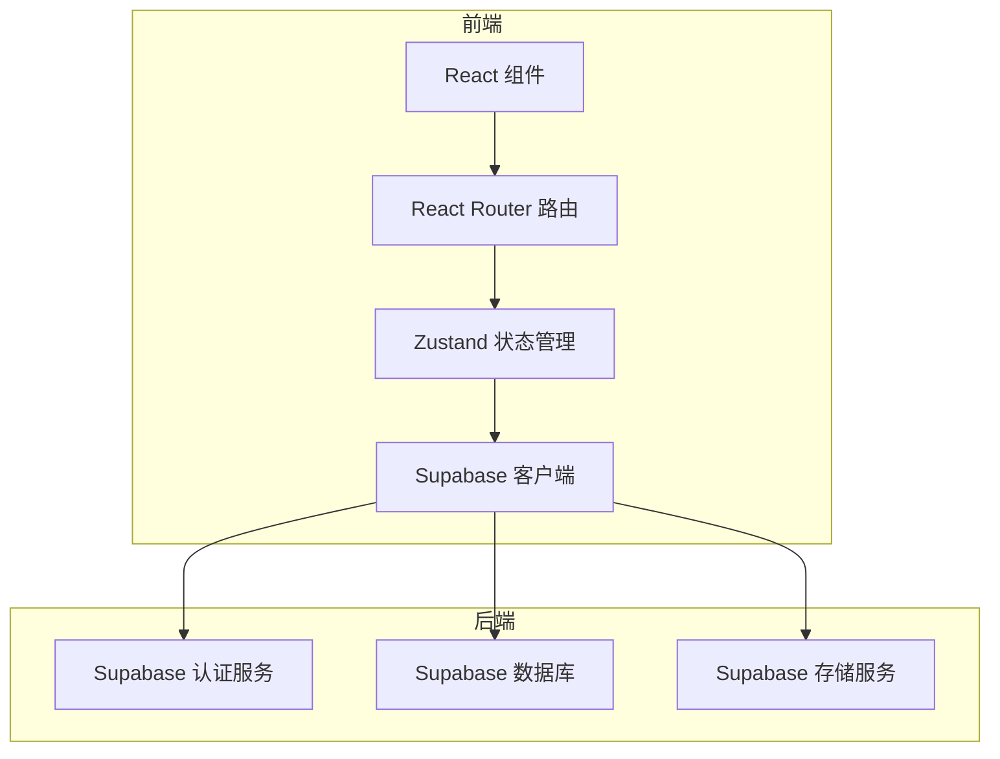
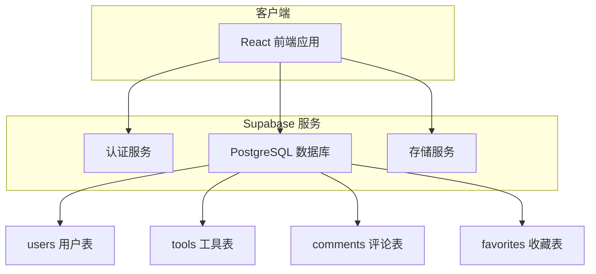
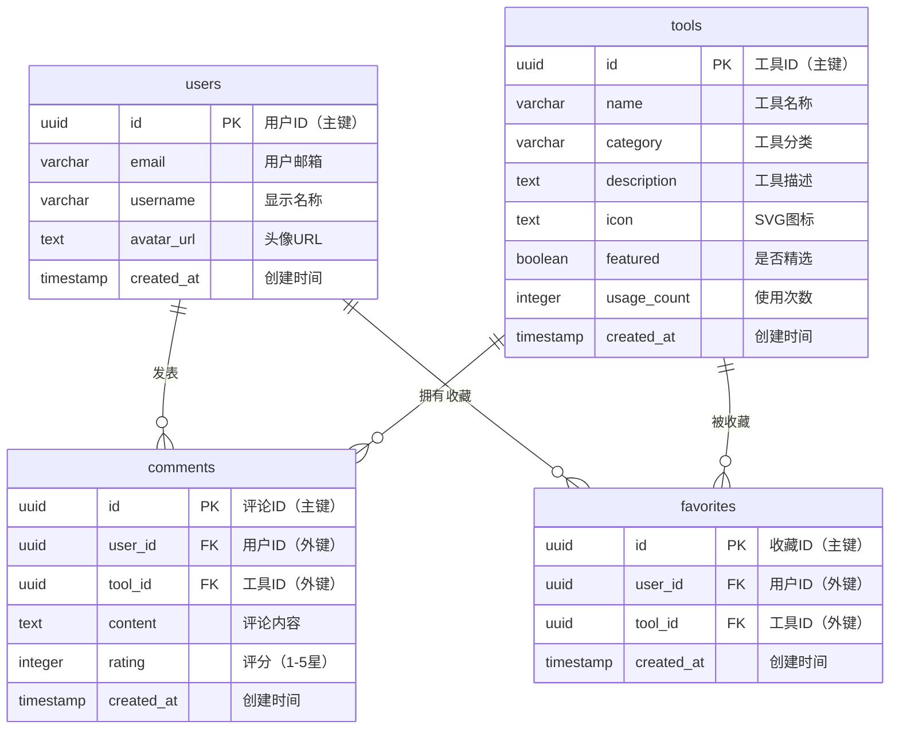

## 1. 架构设计



## 2. 技术栈说明

本项目使用以下技术栈进行开发：

- **前端框架**: React@18 + TypeScript + TailwindCSS@3 + Vite@6
  - React: 用于构建用户界面的 JavaScript 库
  - TypeScript: 为 JavaScript 添加静态类型检查
  - TailwindCSS: 实用优先的 CSS 框架，用于快速构建样式
  - Vite: 下一代前端构建工具，提供快速的开发体验

- **状态管理**: Zustand
  - 轻量级状态管理库，简单易用

- **路由管理**: React Router DOM
  - React 官方路由库，用于管理页面导航

- **后端服务**: Supabase
  - 提供认证、数据库、存储等后端服务
  - 无需自建服务器，开箱即用

## 3. 路由定义

| 路由路径 | 用途说明 |
|---------|---------|
| `/` | 首页，展示工具分类和精选工具 |
| `/tools/:category` | 工具分类页面，展示某一分类下的所有工具 |
| `/tool/:id` | 工具详情页面，包含工具交互界面 |
| `/profile` | 用户个人资料页面 |
| `/community` | 社区页面，展示评论和建议 |
| `/login` | 用户登录页面 |
| `/register` | 用户注册页面 |

## 4. API 定义

### 4.1 认证相关 API（使用 Supabase）
- `signUp(email, password)` - 注册新用户
- `signIn(email, password)` - 用户登录
- `signOut()` - 用户登出
- `getUser()` - 获取当前登录用户信息

### 4.2 工具相关 API（使用 Supabase Client）
- `getTools()` - 获取所有工具列表
- `getToolsByCategory(category)` - 根据分类获取工具列表
- `getToolById(id)` - 根据 ID 获取单个工具详情
- `getFeaturedTools()` - 获取精选工具列表

### 4.3 评论相关 API（使用 Supabase Client）
- `getComments(toolId)` - 获取某工具的所有评论
- `addComment(comment)` - 添加新评论
- `updateComment(id, content)` - 更新评论内容
- `deleteComment(id)` - 删除评论

### 4.4 收藏相关 API（使用 Supabase Client）
- `getFavorites(userId)` - 获取用户收藏的工具列表
- `addFavorite(toolId)` - 添加工具到收藏
- `removeFavorite(toolId)` - 从收藏中移除工具

## 5. 服务器架构图



## 6. 数据模型

### 6.1 数据模型定义



### 6.2 数据库建表语句

```sql
-- 创建工具表
CREATE TABLE tools (
    id UUID PRIMARY KEY DEFAULT gen_random_uuid(),
    name VARCHAR(100) NOT NULL,
    category VARCHAR(50) NOT NULL,
    description TEXT,
    icon TEXT,
    featured BOOLEAN DEFAULT FALSE,
    usage_count INTEGER DEFAULT 0,
    created_at TIMESTAMP DEFAULT NOW()
);

-- 创建评论表
CREATE TABLE comments (
    id UUID PRIMARY KEY DEFAULT gen_random_uuid(),
    user_id UUID REFERENCES auth.users(id),
    tool_id UUID REFERENCES tools(id),
    content TEXT NOT NULL,
    rating INTEGER CHECK (rating >= 1 AND rating <= 5),
    created_at TIMESTAMP DEFAULT NOW()
);

-- 创建收藏表
CREATE TABLE favorites (
    id UUID PRIMARY KEY DEFAULT gen_random_uuid(),
    user_id UUID REFERENCES auth.users(id),
    tool_id UUID REFERENCES tools(id),
    created_at TIMESTAMP DEFAULT NOW(),
    UNIQUE(user_id, tool_id)  -- 同一用户不能重复收藏同一工具
);

-- 插入初始工具数据
INSERT INTO tools (name, category, description, icon, featured) VALUES 
('JSON 格式化工具', '开发工具', '格式化和验证 JSON 数据，支持语法高亮显示', '{"svg":"..."}', true),
('颜色选择器', '设计工具', '从屏幕任意位置拾取颜色值', '{"svg":"..."}', true),
('二维码生成器', '实用工具', '为网址、文本等生成二维码', '{"svg":"..."}', true),
('密码生成器', '安全工具', '生成强随机密码', '{"svg":"..."}', true),
('Base64 编码/解码器', '开发工具', '对字符串进行 Base64 编码和解码', '{"svg":"..."}', false),
('单位转换器', '实用工具', '在不同计量单位之间进行转换', '{"svg":"..."}', false);

-- 设置表权限
GRANT SELECT ON tools TO anon;        -- 匿名用户可以读取工具表
GRANT SELECT ON comments TO anon;     -- 匿名用户可以读取评论表
GRANT SELECT ON favorites TO anon;    -- 匿名用户可以读取收藏表

GRANT ALL PRIVILEGES ON tools TO authenticated;        -- 认证用户拥有工具表全部权限
GRANT ALL PRIVILEGES ON comments TO authenticated;     -- 认证用户拥有评论表全部权限
GRANT ALL PRIVILEGES ON favorites TO authenticated;    -- 认证用户拥有收藏表全部权限
```

## 7. 项目文件结构

```
tool-website/
├── src/                          # 源代码目录
│   ├── components/               # 通用组件目录
│   │   ├── Header.tsx            # 页面头部导航组件
│   │   ├── Footer.tsx            # 页面底部组件
│   │   ├── ToolCard.tsx          # 工具卡片组件
│   │   └── CommentCard.tsx       # 评论卡片组件
│   ├── pages/                    # 页面组件目录
│   │   ├── Home.tsx              # 首页
│   │   ├── ToolPage.tsx          # 工具详情页
│   │   ├── CategoryPage.tsx      # 分类页面
│   │   ├── Profile.tsx           # 用户个人资料页
│   │   ├── Community.tsx         # 社区页面
│   │   ├── Login.tsx             # 登录页面
│   │   └── Register.tsx          # 注册页面
│   ├── tools/                    # 工具功能实现目录
│   │   ├── JsonFormatter.tsx     # JSON 格式化工具
│   │   ├── ColorPicker.tsx       # 颜色选择器工具
│   │   ├── QrCodeGenerator.tsx   # 二维码生成器工具
│   │   └── PasswordGenerator.tsx # 密码生成器工具
│   ├── hooks/                    # 自定义 Hooks 目录
│   │   ├── useAuth.ts            # 认证相关 Hook
│   │   ├── useTools.ts           # 工具数据相关 Hook
│   │   └── useComments.ts        # 评论相关 Hook
│   ├── store/                    # Zustand 状态管理目录
│   │   └── useStore.ts           # 全局状态管理
│   ├── utils/                    # 工具函数目录
│   │   └── supabase.ts           # Supabase 配置
│   ├── types/                    # TypeScript 类型定义目录
│   │   └── index.ts              # 类型定义文件
│   ├── App.tsx                   # 主应用组件
│   ├── main.tsx                  # 应用入口文件
│   └── index.css                 # 全局样式文件
├── .trae/documents/              # 项目文档目录
│   ├── prd.md                    # 产品需求文档
│   └── technical-architecture.md # 技术架构文档
├── index.html                    # HTML 入口文件
├── package.json                  # 项目依赖配置
├── vite.config.ts                # Vite 配置文件
├── tailwind.config.js            # TailwindCSS 配置文件
├── postcss.config.js             # PostCSS 配置文件
├── tsconfig.json                 # TypeScript 配置文件
└── README.md                     # 项目说明文档
```

## 8. 开发和部署流程

### 8.1 本地开发流程
1. 安装依赖：`npm install`
2. 启动开发服务器：`npm run dev`
3. 访问本地地址：`http://localhost:5173`

### 8.2 构建生产版本
1. 执行构建命令：`npm run build`
2. 构建产物会生成在 `dist/` 目录

### 8.3 部署到服务器
1. 将 `dist/` 目录的内容上传到服务器
2. 配置 Nginx 或其他 Web 服务器指向该目录
3. 确保服务器配置了正确的域名和 SSL 证书